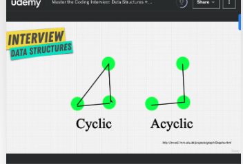
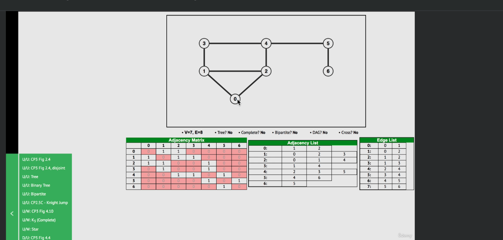
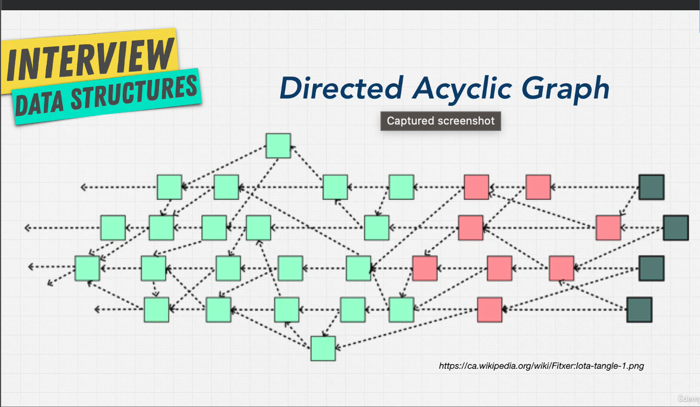

# Graphs

Graphs emcompes a lot of things, Linked Lists are a type of tree. And trees are a type of graphs. They are really good at relationships that we have in the real world.

There are Directed graphs and Undirected graphs

Directed:

Describing traffic flow, where movement is only in one directions

unDirected :
Think of a highway between two cities where you can go both ways in and out.

There is also Weighted and Unweigthed graphs.

Weighted:

Values can be applied to the edges between the connections. This is used to calculate optimal paths to certain locations. I.e fastest way to get to a number

There is also Cyclic and Acyclic

Cyclic graphs is when you can go from one node to another and back to the original one

Quiz:

## This is a Cyclic un weighted un directed graph

An example of a dyrected Acyclic graph

